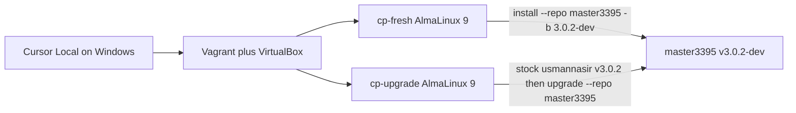

# Windows Cursor: VirtualBox smoke for v3.0.2-dev

Date: 18/08/2026

This is the **full run plan** for **Cursor Local on Windows**. The Contabo AlmaLinux VPS cannot run VirtualBox. Do **not** point Cursor Local at `/usr/local/CyberCP` on the VPS. Do **not** upgrade the live panel.

Fork PR to update after both smokes pass: [master3395/cyberpanel#20](https://github.com/master3395/cyberpanel/pull/20) (`v3.0.2-dev` into mirrored `v3.0.2`).

Short command card: `to-do/VIRTUALBOX-SMOKE.md`.



## 0. What success looks like

Both provisioners exit 0, and `smoke.sh` prints `SMOKE_OK`:

- `lscpd` is active
- HTTPS `:8090` in the guest answers (200, 301, 302, 303, 401, or 403)
- `getPHPString('PHP 8.10')` is `810` (not `10`)

Only then tick the two smoke checkboxes on PR 20.

## 1. Host prerequisites (Windows)

Install, then **close and reopen** PowerShell / Cursor so `PATH` updates.

| Tool | Why |
|------|-----|
| [VirtualBox 7.x](https://www.virtualbox.org/wiki/Downloads) plus Extension Pack | Hypervisor for the AlmaLinux 9 guests |
| [Vagrant](https://developer.hashicorp.com/vagrant/install) | `vagrant up` drives VirtualBox |
| [Git for Windows](https://git-scm.com/download/win) | Clone the fork |
| Python 3 (optional on the host) | Local `Test/test_get_php_string.py` without a VM |

RAM and disk:

- About **4 GB RAM per VM**. Run **one VM at a time** so 8 GB host RAM is enough.
- About **40 GB disk** per VM.
- Nested virtualization is **not** required.

Confirm in **PowerShell**:

```powershell
vagrant version
VBoxManage --version
git --version
```

If either `vagrant` or `VBoxManage` is missing, stop. Cursor cannot invent those binaries.

Hyper-V note: if VirtualBox refuses to start 64-bit guests, disable Hyper-V / Memory Integrity / Windows Hypervisor Platform, reboot, and retry. WSL2 can also hold the hypervisor.

## 2. Clone the fork (not the VPS tree)

Do this on the Windows PC:

```powershell
cd $env:USERPROFILE\src
# or any folder you prefer, e.g. D:\src
git clone https://github.com/master3395/cyberpanel.git
cd cyberpanel
git fetch origin
git checkout v3.0.2-dev
git pull origin v3.0.2-dev
```

Open **that folder** in Cursor (`File > Open Folder`). This is Cursor Local. Do not Remote-SSH into the VPS for this smoke.

Confirm you are on the fork branch:

```powershell
git remote -v
git branch --show-current
git log -1 --oneline
```

Expect:

- `origin` is `master3395/cyberpanel`
- branch is `v3.0.2-dev`
- `Test\virtualbox\up.ps1` exists

## 3. Prompt to paste into Cursor Local (Windows)

Use Agent mode. Paste this as the user message:

```text
Follow to-do/WINDOWS-CURSOR-SMOKE-PLAN.md (and .cursor/plans/windows-cursor-vbox-smoke.plan.md).

Run the VirtualBox smokes on this Windows machine only. Do not SSH to the Contabo VPS. Do not touch /usr/local/CyberCP.

Order:
1. Confirm vagrant and VBoxManage exist.
2. python Test/test_get_php_string.py if Python is installed.
3. cd Test\virtualbox; .\up.ps1 fresh; wait until vagrant up exits 0; .\up.ps1 smoke-fresh.
4. .\up.ps1 halt
5. .\up.ps1 upgrade; wait until vagrant up exits 0; .\up.ps1 smoke-upgrade.
6. Report SMOKE_OK or the first failing line. Do not tick PR 20 yourself unless both smokes passed.
7. Ask me before .\up.ps1 destroy.
```

## 4. Optional host unit test (no VM)

From the repo root, if Python 3 is on PATH:

```powershell
python Test\test_get_php_string.py
```

Expect 6 tests OK, including `PHP 8.10` -> `810`. This does **not** replace the VM smokes.

## 5. Fresh install smoke (`cp-fresh`)

**Time:** 15 to 40 minutes. **Host ports:** `18090` -> guest `8090`, `10080` -> `80`, `10443` -> `443`, `10022` -> `22`.

```powershell
cd Test\virtualbox
.\up.ps1 fresh
```

What that does:

1. `vagrant up cp-fresh --provider virtualbox`
2. Box `almalinux/9` (downloaded once)
3. `provision-fresh.sh`: silent OLS install

```bash
bash /tmp/cyberpanel.sh -v ols -p TestPass12 -b 3.0.2-dev --repo master3395
```

When `vagrant up` returns 0:

```powershell
.\up.ps1 smoke-fresh
```

Expect `SMOKE_OK` in the SSH output.

Browser (ignore the self-signed cert warning): `https://127.0.0.1:18090`  
Admin password (lab only): `TestPass12`

Free RAM before the second VM:

```powershell
.\up.ps1 halt
```

## 6. Upgrade smoke (`cp-upgrade`)

**Time:** 30 to 60 minutes. **Host ports:** `28090` -> `8090`, `20080` -> `80`, `20443` -> `443`, `20022` -> `22`.

Keep `cp-fresh` halted (or destroyed) so you do not run two 4 GB VMs at once.

```powershell
cd Test\virtualbox
.\up.ps1 upgrade
```

What that does:

1. Stock install from `usmannasir/cyberpanel` `v3.0.2`
2. Then modular upgrade:

```bash
bash /usr/local/cyberpanel_upgrade.sh -b v3.0.2-dev --repo master3395 --mariadb-version 11.8
```

When `vagrant up` returns 0:

```powershell
.\up.ps1 smoke-upgrade
```

Expect `SMOKE_OK`.

Browser: `https://127.0.0.1:28090`  
Password: `TestPass12`

## 7. After both pass

1. On [PR 20](https://github.com/master3395/cyberpanel/pull/20), tick:
   - Fresh install smoke
   - Upgrade smoke
2. Optional: leave a comment with `SMOKE_OK` timestamps. Do **not** open or comment on `usmannasir/cyberpanel` PRs.
3. Reclaim disk:

```powershell
cd Test\virtualbox
.\up.ps1 destroy
```

Other wrappers: `.\up.ps1 status` (Vagrant status), `.\up.ps1 halt` (stop without deleting).

## 8. If something fails

| Symptom | What to do |
|---------|------------|
| `Missing vagrant` / `Missing VBoxManage` | Install VirtualBox + Vagrant, reopen Cursor |
| Box download timeout | Retry `.\up.ps1 fresh`; first `almalinux/9` pull is large |
| VT-x / AMD-V / Hyper-V error | Disable Hyper-V / Core Isolation Memory Integrity, reboot |
| Port already in use (`18090` / `28090`) | `.\up.ps1 status`; halt the other VM; or stop whatever bound the port |
| `vagrant up` non-zero during CyberPanel install | `vagrant ssh cp-fresh` (or `cp-upgrade`) and read installer logs under `/var/log/` |
| Smoke: `FAIL lscpd not active` | Guest install did not finish; read logs before re-provision |
| Smoke: `getPHPString` not `810` | Wrong tree in `/usr/local/CyberCP`; confirm branch `v3.0.2-dev` and the `#1834` regex in `plogical/acl.py` |
| Fresh provision 404 on raw GitHub | Confirm `https://github.com/master3395/cyberpanel/blob/v3.0.2-dev/cyberpanel.sh` exists |

Re-run a single machine after a failed provision (from `Test\virtualbox`):

```powershell
vagrant destroy -f cp-fresh
.\up.ps1 fresh
```

Same pattern with `cp-upgrade` / `.\up.ps1 upgrade`.

## 9. Out of scope

- Live Contabo `/usr/local/CyberCP` (stays `v3.0.0-dev`)
- Ubuntu 24/26 VMs
- LiteSpeed Enterprise serial installs
- Opening a PR against `usmannasir/cyberpanel`

## 10. Script map

All under `Test/virtualbox/`:

| File | Role |
|------|------|
| `Vagrantfile` | Two machines, `almalinux/9`, 4 GB / 2 CPUs, forwarded ports |
| `provision-fresh.sh` | Fork OLS install `3.0.2-dev --repo master3395` |
| `provision-upgrade.sh` | Stock `v3.0.2` then upgrade to fork |
| `smoke.sh` | `lscpd`, `:8090`, `getPHPString` 8.6 / 9.0 / 8.10 / malformed |
| `up.ps1` | `fresh`, `upgrade`, `smoke-fresh`, `smoke-upgrade`, `halt`, `destroy`, `status` |
